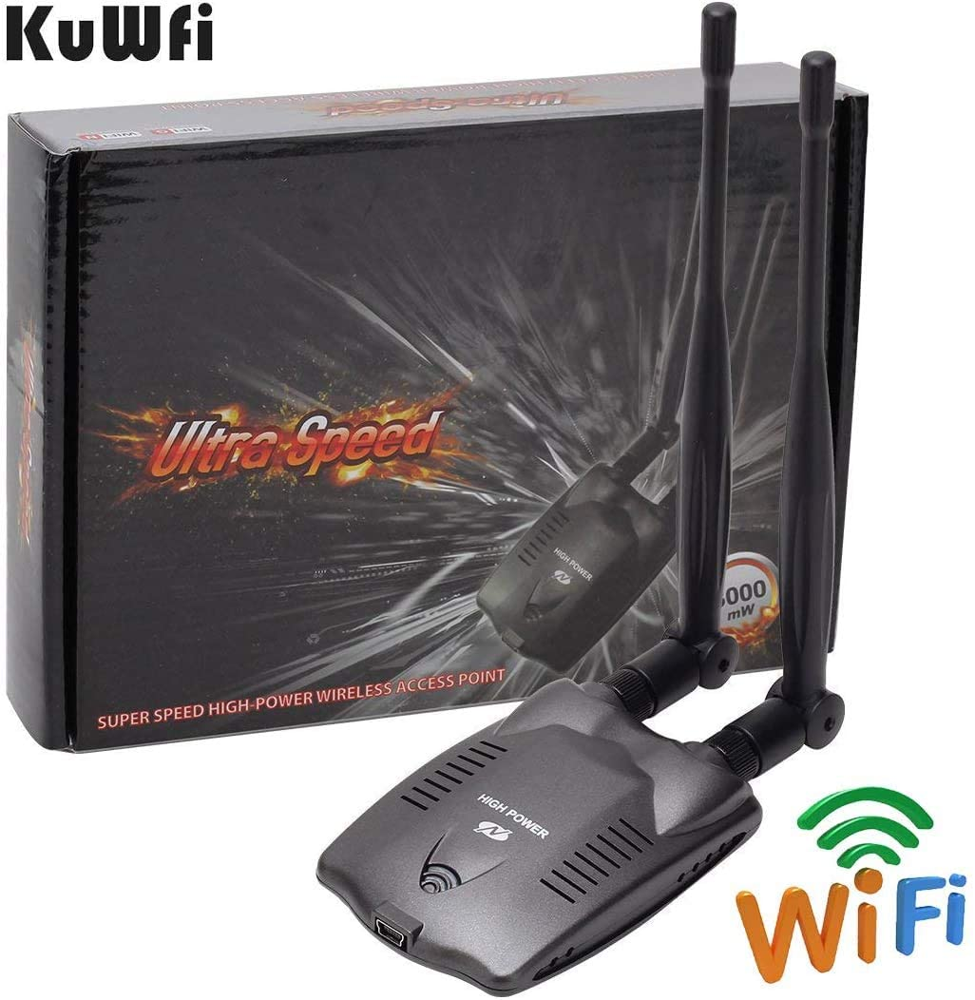
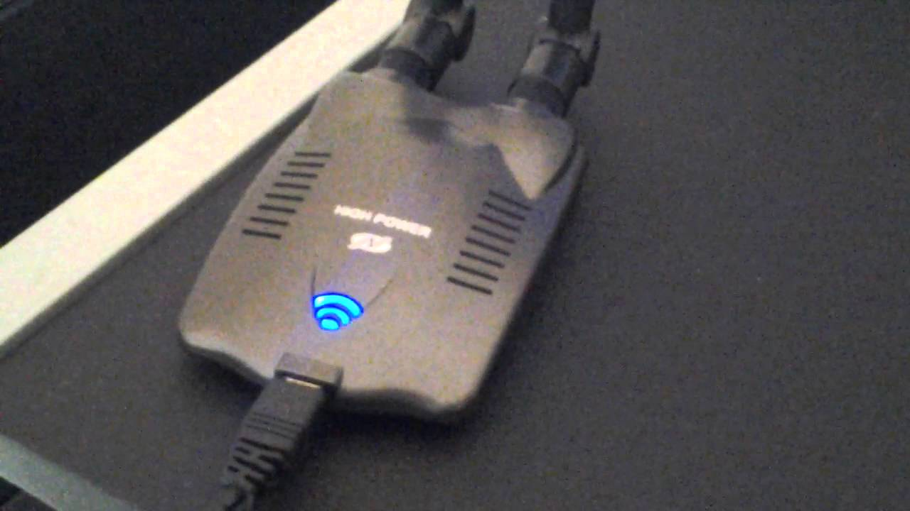

# REALTEK-RTL8192FU_RTL8725AU
## Realtek driver rtl8192fu/rtl8725au driver

### adaptor example:

if your having a trouble recompiling or your looking for a driver.
your in the right place.
make sure you are looking for this driver:
### N9100 high power 3000mW wifi

N9100 high power 3000mW wifi adaptor is no longger using a ralink3070 driver.
instead they start working with realtek. tested on kali linux 2019.2 kernel 4.19.0

to get started.
type:

    lsusb
    
Realtek Semiconductor Corp.
    
    git clone https://github.com/johnsmith80/REALTEK-RTL8192FU.git
    cd REALTEK-RTL8192FU
    unzip N9100-RTL8192FU_RTL8725AU-wifi-driver.zip
    cd N9100-RTL8192FU_RTL8725AU-wifi-driver
    chmod +x Makefile
    make
    make install

Full Driver Installer:

N9100 Easy setup?:

Download This Driver from Mediafire:

http://www.mediafire.com/file/09i8ro6p6fjt7os/RTL8192FU_RTL8725AU-linux-driver.zip/file

    cd Downloads
    unzip RTL8192FU_RTL8725AU-linux-driver.zip
    cd RTL8192FU_RTL8725AU-linux-driver
    chmod +x install.sh
    sudo ./install.sh

Link not working?

  https://github.com/johnsmith80/REALTEK-RTL8192FU_RTL8725AU/issues
  
  will send you another link
  
Other supported version:
  
  tested: kernel 5.7.x
                 5.x
  https://github.com/blackPantherOS/rtl8192fu.git
  
                            by: blackPantherOS
